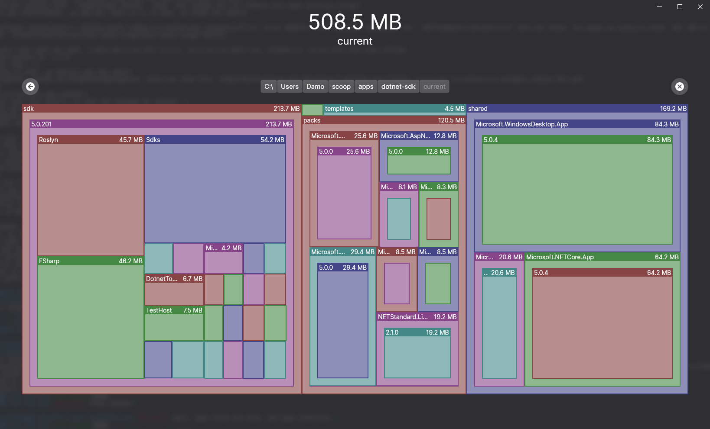

# Disk Space Usage

This is a small desktop app that will allow you to analyze
the disk space usage of a given directory of your choosing.

It's built in [F#](https://fsharp.org) using [Avalonia](https://avaloniaui.net/)
and its [functional extensions](https://avaloniacommunity.github.io/Avalonia.FuncUI.Docs/).

It runs cross-platform (on Windows, Linux and Mac OS) using **.NET 5**.

## Screenshot



## Local Setup

### Dependencies
.NET 5

### Running the build

```
dotnet build
```

### Running the app

```
dotnet run
```
